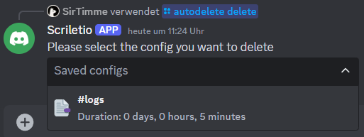

<h1 align="center">Scriletio</h1>

    
    
    
    

<h3 align="center">Scriletio is a discord bot that automatically   deletes your messages after a configured duration.</h3> 

## Table of contents

1. [Commands](#commands)
2. [Self-hosting](#self-hosting)

## Commands

### Overview

| Command                                                                          | Task                                                           |
|----------------------------------------------------------------------------------|----------------------------------------------------------------|
| [/register](#register)                                                           | Registers yourself in the database                             |
| [/autodelete add \<channel> \<duration>](#autodelete-add-channel-duration)       | Adds an autodelete config for the specified channel            |
| [/autodelete get](#autodelete-get)                                               | Displays an overview for all autodelete configs in this server |
| [/autodelete update \<channel> \<duration>](#autodelete-update-channel-duration) | Updates an existing config with the specified duration         |
| [/autodelete delete](#autodelete-delete)                                         | Deletes an existing autodelete config                          |
| [/delete](#delete)                                                               | Deletes all of your stored data from the database              |

---

### /register

> [!NOTE]
> | Parameter | Type | Required |
> | -- | -- | -- |
> | - | - | - |

Example:

---

### /autodelete add \<channel> \<duration>

> [!NOTE]
> | Parameter | Type | Required |
> | -- | -- | -- |
> | channel | Textchannel | true |
> | duration | String | true |

Example:

For more information regarding the **duration** format [click here](#duration-format).

---

### /autodelete get

> [!NOTE]
> | Parameter | Type | Required |
> | -- | -- | -- |
> | - | - | - |

Example:

---

### /autodelete update \<channel> \<duration>

> [!NOTE]
> | Parameter | Type | Required |
> | -- | -- | -- |
> | channel | Textchannel | true |
> | duration | String | true |

Example:

> [!IMPORTANT]
> The choices for **channel** are dynamically resolved based on your saved autodelete configs.\
> You need to use one of the provided choices to update an autodelete config!
>
> 

For more information regarding the **duration** format [click here](#duration-format).

---

### /autodelete delete

> [!NOTE]
> | Parameter | Type | Required |
> | -- | -- | -- |
> | - | - | - |

Example:

---

### /delete

> [!NOTE]
> | Parameter | Type | Required |
> | -- | -- | -- |
> | - | - | - |

Example:

> [!CAUTION]
> When clicking **Accept** all of your saved autodelete configs will be deleted.\
> This also means that the scheduled deletion of messages in these channels will be cancelled!

---

### Duration format

> [!IMPORTANT]
> The duration format is structured as follows:\
> The duration is specified with a **number**, followed by a **letter** for the unit. These letters are permitted:
>
> | Letter     | Unit   |
> |------------|--------|
> | `D` or `d` | Day    |
> | `H` or `h` | Hour   |
> | `M` or `m` | Minute |
>
> The order of the units **does not** matter.\
> You can even specify **multiple** durations of the **same** unit (e.g. `3H3H`). It is simply added together.

Examples:
- `4D` or `4d` = 4 days
- `2D3H` or `2d3h` = 2 days 3 hours
- `1D5H3M` or `1d5h3m` = 1 day 5 hours 3 minutes

## Self-hosting

